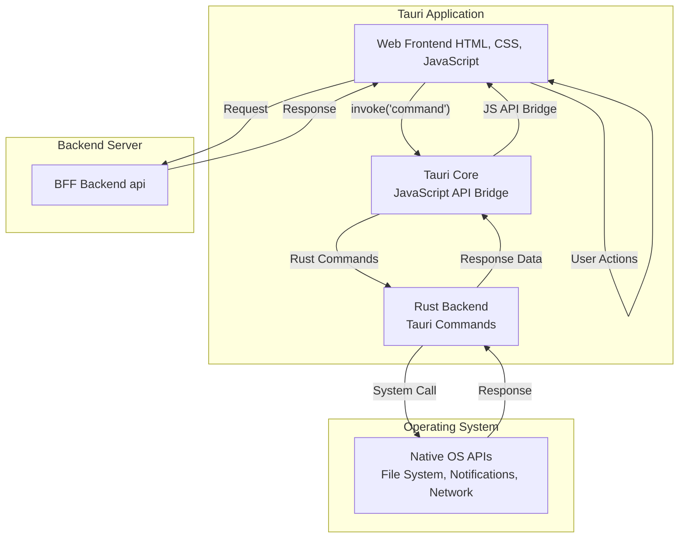

```mermaid
graph TD
    %% User가 Tauri 애플리케이션을 실행하고 상호작용하는 과정을 나타냄
    subgraph Tauri Application
        %% Web Frontend
        A[Web Frontend HTML, CSS, JavaScript]

        %% Tauri Core
        B[Tauri Core<br>JavaScript API Bridge]

        %% Backend - Rust로 작성된 로직
        C[Rust Backend<br>Tauri Commands]

        %% 프론트엔드와 백엔드의 데이터 흐름
        A -- User Actions --> A
        A -- invoke('command') --> B
        B -- Rust Commands --> C
        C -- Response Data --> B
        B -- JS API Bridge --> A
    end

    %% 프론트 및 백엔드 통신을 설명
    subgraph Backend Server
        Z[BFF Backend api]
        A -- Request --> Z
        Z -- Response --> A
    end

    %% Operating System와의 상호작용을 나타냄
    subgraph Operating System
        D[Native OS APIs<br>File System, Notifications, Network]
    end

    %% 데이터 흐름 연결
    C -- System Call --> D
    D -- Response --> C
```
